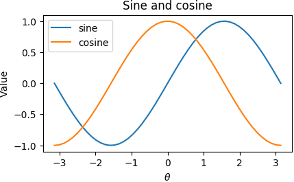
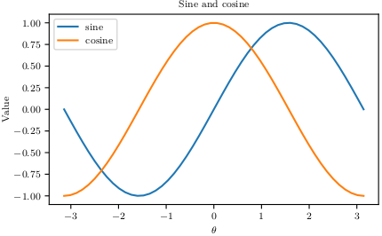
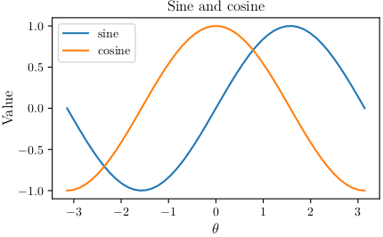

=====
Usage
=====

To use LaTeXiPy in a project::

    import latexipy as lp

Set up for LaTeX with::

    lp.latexify()

And make your figures with::

    with lp.figure('filename'):
        draw_the_plot()

Import from LaTeX with:

.. code-block:: latex

    \usepackage{pgf}
    \input{filename.pgf}

Example files
=============
From the ``latexipy`` Github repository.

* Python_
* Latex_
* PDF_

.. _Python: https://github.com/masasin/latexipy/blob/master/examples/examples.py
.. _Latex: https://github.com/masasin/latexipy/blob/master/examples/example.tex
.. _PDF: https://github.com/masasin/latexipy/raw/master/examples/example.pdf

Minimum Working Example
=======================
.. code-block:: python
    :caption: sincos_plotter.py
    :emphasize-lines: 4, 6, 8

    import numpy as np
    import matplotlib.pyplot as plt
    
    import latexipy as lp

    lp.latexify()

    with lp.figure('sincos'):
        x = np.linspace(-np.pi, np.pi)
        y_sin = np.sin(x)
        y_cos = np.cos(x)
        plt.plot(x, y_sin, label='sine')
        plt.plot(x, y_cos, label='cosine')
        plt.title('Sine and cosine')
        plt.xlabel(r'$\theta$')
        plt.ylabel('Value')
        plt.legend()

.. code-block:: latex
    :caption: sincos_report.tex
    :emphasize-lines: 3, 8

    \documentclass{article}

    \usepackage{pgf}

    \begin{document}
      \begin{figure}[h]
        \centering
        \input{img/filename.pgf}
        \caption[LOF caption]{Regular caption.}
        \label{fig:pgf_example}
      \end{figure}
    \end{document}

Plotting
========
Without LaTeX
-------------
If you are not making your plots for LaTeX, Matplotlib's defaults are used.
The typeface is sans-serif, and the font, a bit large.
The default arguments save a PGF and PNG file in the ``img/`` directory.

.. code-block:: python
    :emphasize-lines: 1

    with lp.figure('sincos'):
        plot_sin_and_cos()

With LaTeX
----------
If you are building for LaTeX, just ``lp.latexify()``!

.. code-block:: python
    :emphasize-lines: 1, 3

    lp.latexify()

    with lp.figure('sincos'):
        plot_sin_and_cos()

Using custom parameters
-----------------------
By default, ``lp.latexify()`` uses ``lp.PARAMS``, which has the following values:

.. literalinclude:: ../latexipy/_latexipy.py
    :caption: _latexipy.py
    :linenos:
    :lineno-start: 22
    :lines: 22-41
    
Passing a different dictionary to ``lp.latexify()`` causes these changes to be permanent in the rest of the code.
For example, to increase the font size throughout:

.. literalinclude:: ../examples/examples.py
    :caption: examples.py
    :emphasize-lines: 2, 3, 6
    :linenos:
    :lineno-start: 93
    :lines: 93-101

You can call ``lp.latexify()`` multiple times throughout your code, but if you want to change the setting only for a few figures, the recommended approach is to use ``lp.temp_params()``. This automatically reverts to the previous settings after saving (or attempting to save) the plot.

.. literalinclude:: ../examples/examples.py
    :caption: examples.py
    :emphasize-lines: 2
    :linenos:
    :lineno-start: 87
    :lines: 87-90

Either way, the font size would have increased uniformly from 8 to 10 pt.

.. image:: ../examples/img/sincos_big_font_temp.png

Note that ``lp.temp_params()`` can also take a custom dictionary which can do more fine-grained tuning of fonts.

.. literalinclude:: ../examples/examples.py
    :caption: examples.py
    :emphasize-lines: 1
    :linenos:
    :lineno-start: 111
    :lines: 111-116

Reverting
---------
To revert all changes made with ``lp.latexify()`` and other commands, just run ``lp.revert()``.

Avoiding repetition
===================
If you keep passing the same arguments to ``lp.figure()`` (for example, an output directory, a set of filetypes, or a certain size), you can save it for reuse by using ``functools.partial()``.  
After that, you can use it just like ``lp.figure()``.
Note that you would not be able to redifine an argument that you had previously applied.

.. code-block:: python
    :emphasize-lines: 1, 3

    figure = partial(lp.figure, directory=DIRECTORY)

    with figure('sincos_partial'):
        plot_sin_and_cos()

where ``DIRECTORY`` is the default output directory.
This pattern was used extensively in the Python_ file from the examples_ directory.

Using in LaTeX
==============
To include a PGF file in your LaTeX document, make sure that the ``pgf`` package is loaded in the preamble.

.. code-block:: latex

    \usepackage{pgf}

After that, you can include it in the correct location with:

.. code-block:: latex

    \input{<filename>.pgf}

A minimum working example of an image within a figure is shown below.

.. code-block:: latex
    :emphasize-lines: 3, 8

    \documentclass{article}

    \usepackage{pgf}

    \begin{document}
      \begin{figure}[h]
        \centering
        \input{img/filename.pgf}
        \caption[LOF caption]{Regular caption.}
        \label{fig:pgf_example}
      \end{figure}
    \end{document}

Note that figures using additional raster images can only be included by ``\input{}`` if they are in the same directory as the main LaTeX file.
To load figures from other directories, you can use the ``import`` package instead.

.. code-block:: latex

  \usepackage{import}
  \import{<path to file>}{<filename>.pgf}

A minimum working example of that scenario is shown below.

.. code-block:: latex
    :emphasize-lines: 3, 4, 9

    \documentclass{article}

    \usepackage{import}
    \usepackage{pgf}

    \begin{document}
      \begin{figure}[h]
        \centering
        \import{/path/to/file/}{filename.pgf}  % Note trailing slash.
        \caption[LOF caption]{Regular caption.}
        \label{fig:pgf_example}
      \end{figure}
    \end{document}

.. _examples: https://github.com/masasin/latexipy/tree/master/examples
